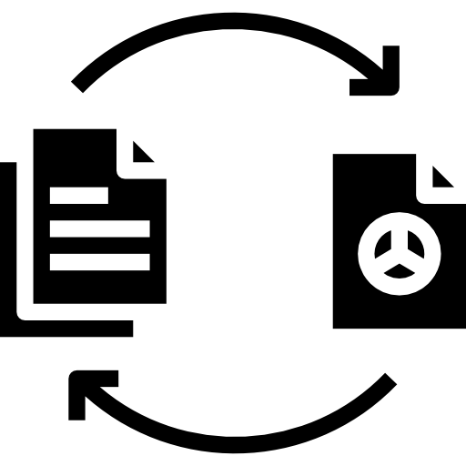

<div id="top"></div>

<!-- PROJECT LOGO -->
<br />
<div align="center">
  
  <h1 align="center">Video Transcoder</h1>

  <h3 align="center">
    A Laravel queued video transcoder
    <br />
  </h3>
</div>


<!-- TABLE OF CONTENTS -->
<details>
  <summary>Table of Contents</summary>
  <ol>
    <li>
      <a href="#about-the-project">About The Project</a>
      <ul>
        <li><a href="#built-with">Built With</a></li>
      </ul>
    </li>
    <li><a href="#installation">Installation</a></li>
    <li><a href="#usage">Usage</a></li>
    <li><a href="#license">License</a></li>
    <li><a href="#acknowledgments">Acknowledgments</a></li>
  </ol>
</details>


<!-- ABOUT THE PROJECT -->
## About The Project

This project is a video transcoding website which uses FFmpeg along with Laravel and the Laravel Queue package to convert video files uploaded by the user.


### Built With

* [Laravel](https://laravel.com/)
* [FFmpeg](https://ffmpeg.org/)


## Installation

To install the application follow the steps below:

1. Clone the repo
   ```sh
   git clone https://github.com/ScottMilne/VideoTranscoder.git
   ```
2. Install NPM packages
   ```sh
   npm install
   ```
3. Enter database details in `.env`
    ```js
    DB_CONNECTION=
    DB_HOST=
    DB_PORT=
    DB_DATABASE=
    DB_USERNAME=
    DB_PASSWORD=
    ```
4. Enter FFmpeg binaries in `.env`
   ```js
   FFMPEG_BINARIES='C:/ffmpeg/bin/ffmpeg.exe'
   FFPROBE_BINARIES='C:/ffmpeg/bin/ffprobe.exe'
   ```
5. Migrate database tables
   ```sh
   php artisan migrate
   ```


<!-- USAGE EXAMPLES -->
## Usage

To make the application operational follow the instructions below:

1. Launch the development server
   ```sh
   php artisan serve
   ```
2. Create an instance to execute jobs
   ```sh
   php artisan queue:work 
   ```


<!-- LICENSE -->
## License

Distributed under the MIT License.


<!-- ACKNOWLEDGMENTS -->
## Acknowledgments

* [Laravel-ffmpeg](https://github.com/protonemedia/laravel-ffmpeg)

<p align="right">(<a href="#top">back to top</a>)</p>
